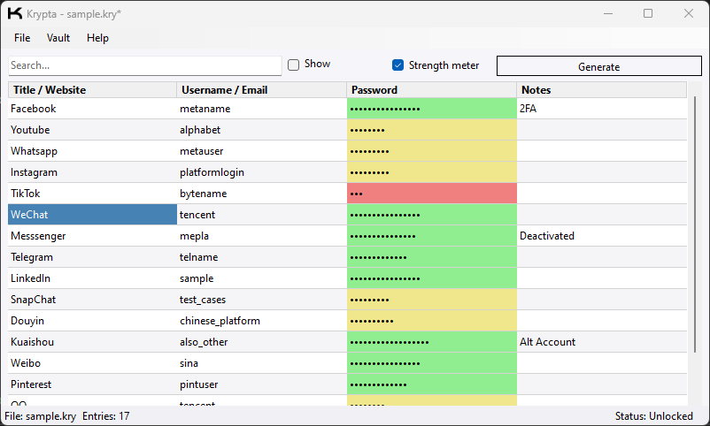

# Krypta
A lightweight, encrypted desktop password manager built in **C# (.NET / Windows Forms)**.

---

## Overview
Krypta securely stores and organizes user credentials in encrypted `.kry` vaults.  
Each vault is protected using **AES-256 encryption** with PBKDF2 key derivation.

---

## Features
- Create, open, save, and close encrypted vaults
- Auto-lock on lost focus
- Password generator and color-coded strength meter
- Search and filter entries
- Show/hide passwords
- Save prompts for unsaved changes
- Keyboard shortcuts for common actions
- Status bar with lock indicator (click to unlock)
- Offline and self-contained — no network use

---

## Screenshot

---

## Security
- AES-256 encryption (PBKDF2-derived key)
- No plaintext passwords stored on disk
- Auto-lock clears decrypted data from memory
- Optional manual lock/unlock with prompts

---

## Documentation
[Full Project Report (PDF)](Documentation/Krypta.pdf)

---

## License
Released under the [MIT License](LICENSE).
